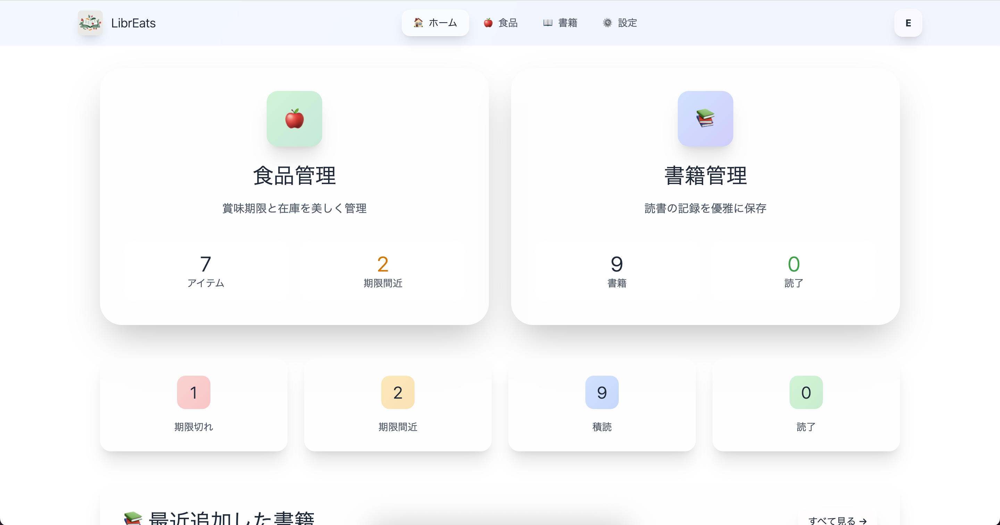
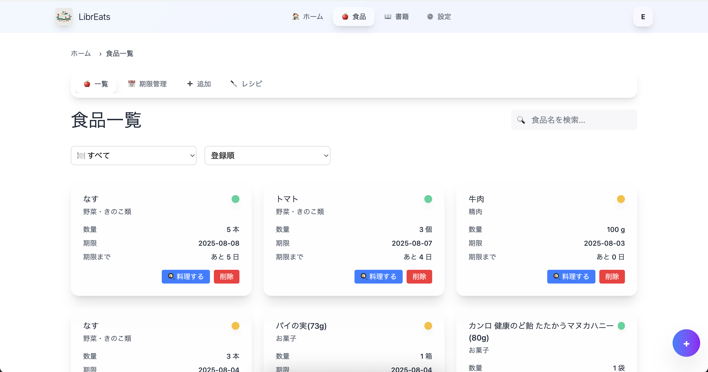
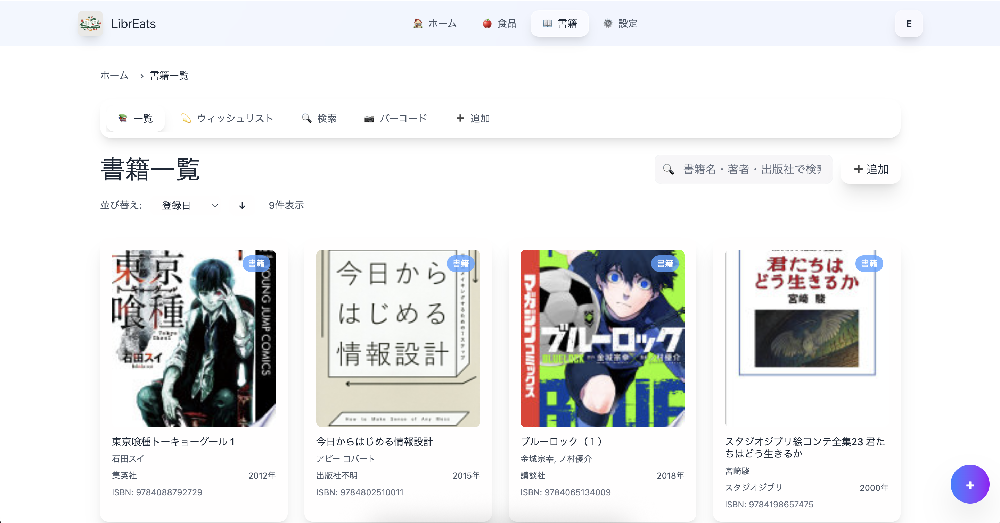
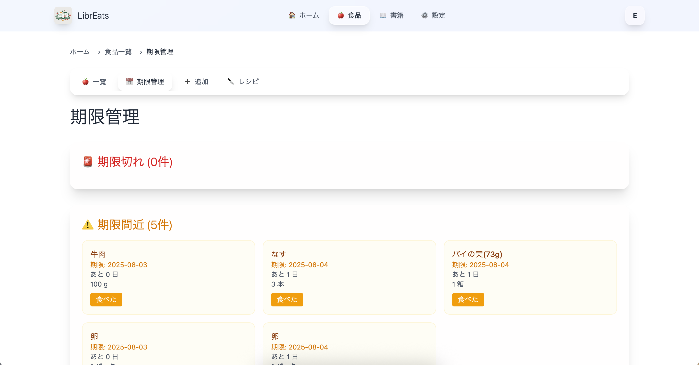
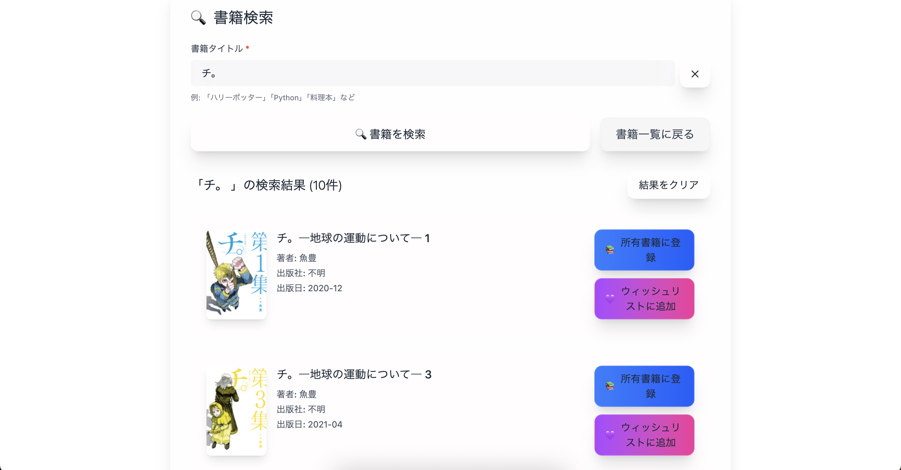
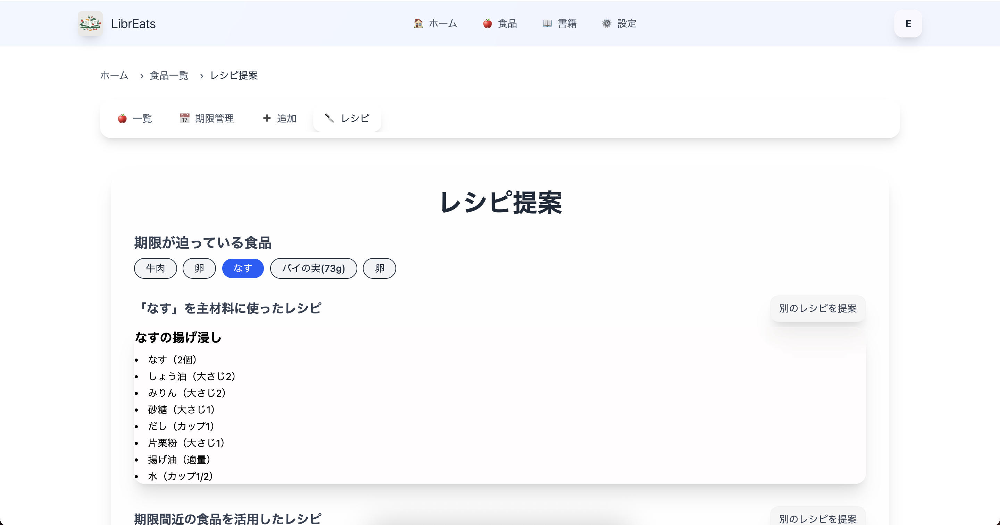
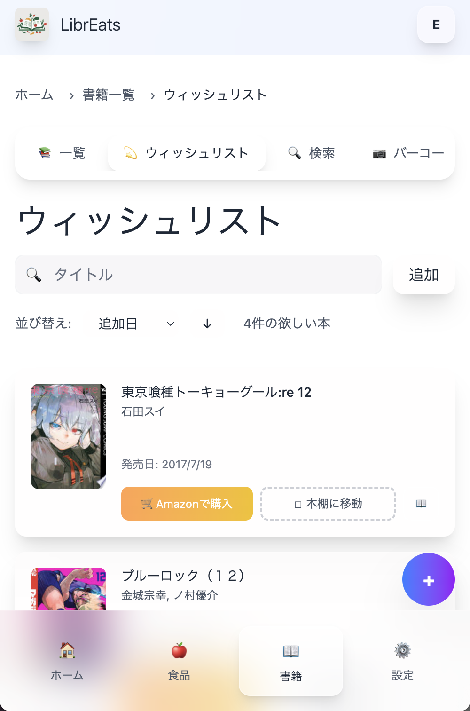
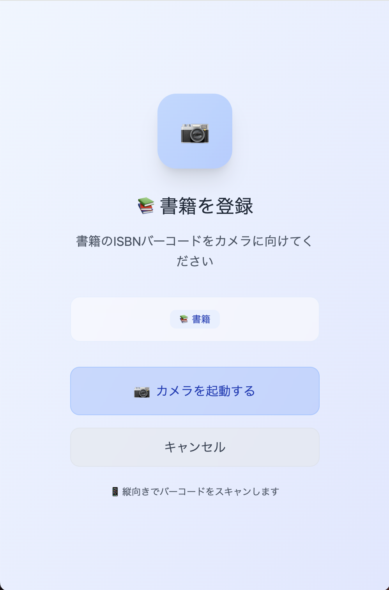
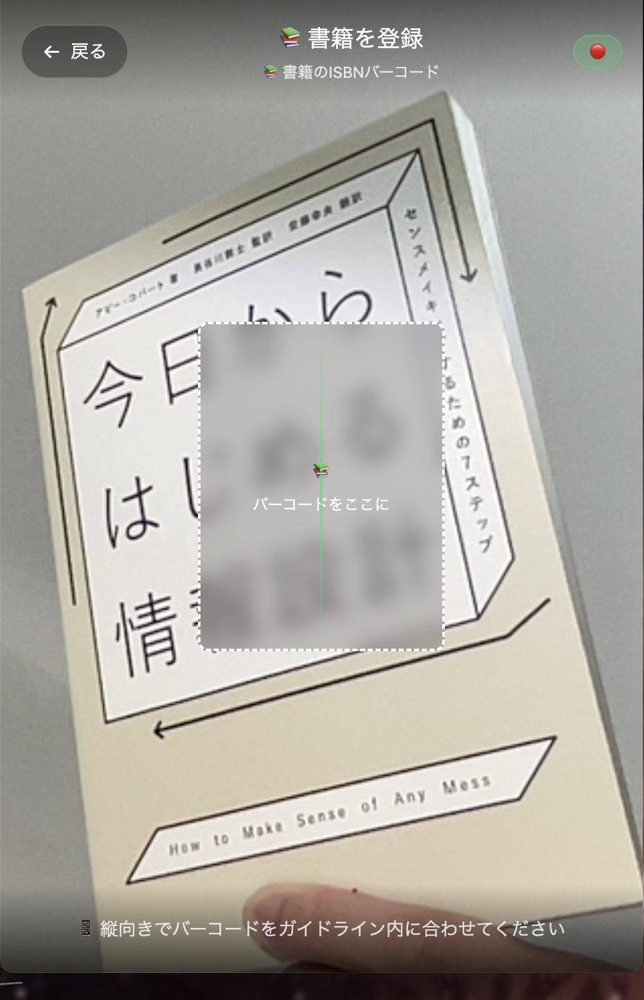
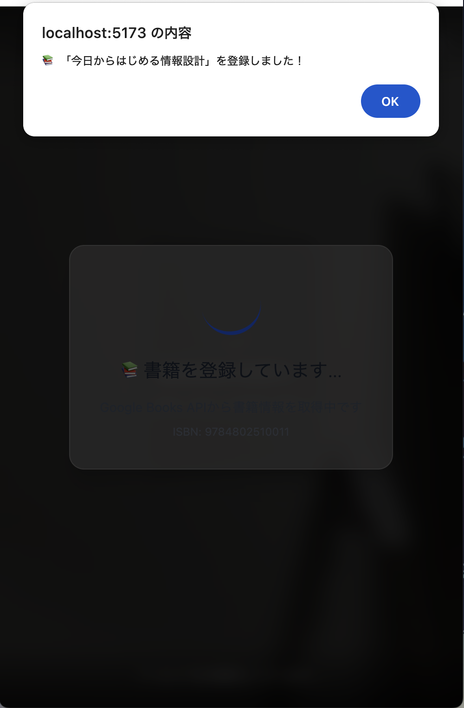

#  LibrEats

<div align="center">
  <div style="padding: 50px 0 80px 0;">
  
  </div>
</div>

> **Library + Eats** - 知識と食生活を一元管理するモダンPWAアプリ

[](https://reactjs.org/)
[](https://fastapi.tiangolo.com/)
[](https://www.typescriptlang.org/)
[](https://www.docker.com/)

### デモ動画
**LibrEats-demo**
[](https://www.youtube.com/watch?v=S4OUvLMFAYU)

### アプリ画面
<div align="center">

<div style="display: grid; grid-template-columns: 1fr 1fr; gap: 20px; max-width: 1300px; margin: 0 auto; padding: 20px;">

<div style="background: linear-gradient(145deg, #f0f0f0, #ffffff); border-radius: 20px; padding: 10px; box-shadow: 0 8px 32px rgba(0,0,0,0.1);">
  

</div>

<div style="background: linear-gradient(145deg, #f0f0f0, #ffffff); border-radius: 20px; padding: 10px; box-shadow: 0 8px 32px rgba(0,0,0,0.1);">
  

</div>

<div style="background: linear-gradient(145deg, #f0f0f0, #ffffff); border-radius: 20px; padding: 10px; box-shadow: 0 8px 32px rgba(0,0,0,0.1);">
  

</div>

<div style="background: linear-gradient(145deg, #f0f0f0, #ffffff); border-radius: 20px; padding: 10px; box-shadow: 0 8px 32px rgba(0,0,0,0.1);">
  

</div>

<div style="background: linear-gradient(145deg, #f0f0f0, #ffffff); border-radius: 20px; padding: 10px; box-shadow: 0 8px 32px rgba(0,0,0,0.1);">
  

</div>

<div style="background: linear-gradient(145deg, #f0f0f0, #ffffff); border-radius: 20px; padding: 10px; box-shadow: 0 8px 32px rgba(0,0,0,0.1);">
  

</div>

</div>

</div>

#### 📱 モバイル画面

<div style="display: grid; grid-template-columns: repeat(4, 1fr); gap: 15px; max-width: 800px; margin: 20px auto; padding: 0 20px;">

<div style="background: linear-gradient(145deg, #f0f0f0, #ffffff); border-radius: 15px; padding: 8px; box-shadow: 0 4px 16px rgba(0,0,0,0.1);">
  

</div>

<div style="background: linear-gradient(145deg, #f0f0f0, #ffffff); border-radius: 15px; padding: 8px; box-shadow: 0 4px 16px rgba(0,0,0,0.1);">
  

</div>

<div style="background: linear-gradient(145deg, #f0f0f0, #ffffff); border-radius: 15px; padding: 8px; box-shadow: 0 4px 16px rgba(0,0,0,0.1);">
  
</div>

<div style="background: linear-gradient(145deg, #f0f0f0, #ffffff); border-radius: 15px; padding: 8px; box-shadow: 0 4px 16px rgba(0,0,0,0.1);">
  
</div>

</div>

<!-- モバイル表示用（画面幅が小さい場合は2列表示） -->
<style>
@media (max-width: 768px) {
  .mobile-grid {
    grid-template-columns: repeat(2, 1fr) !important;
    gap: 10px !important;
  }
}
</style>

</div>

## 🎯 プロジェクト概要

LibrEatsは、**書籍管理**と**食品管理**を統合した革新的なPWAアプリです。バーコード読み取り機能とAI技術を活用し、現代の生活に必要な「知識の管理」と「食生活の最適化」を一つのアプリで実現します。

### ✨ 主な特徴

- 📷 **スマートバーコードスキャン** - ISBN・JANコード自動識別
- 🤖 **AI レシピ提案** - 期限間近食材から最適なレシピを生成
- 📱 **PWA対応** - アプリストア不要でインストール可能
- 🔒 **セキュア認証** - JWT認証による安全なデータ管理

## 🚀 主要機能

### 📚 Library（書籍管理）

| 機能 | 説明 |
|------|------|
| 📷 バーコードスキャン | ISBNバーコード読み取りで自動登録 |
| 🔍 書籍検索 | Google Books APIによるタイトル検索 |
| 📖 読書管理 | 読了ステータス・お気に入り機能 |
| 💜 ウィッシュリスト | 欲しい本の管理とAmazonリンク |
| 📊 読書統計 | 登録数・読了数の可視化 |

### 🍽️ Eats（食品管理）

| 機能 | 説明 |
|------|------|
| 🛒 食品登録 | JANコード読み取り・手動入力対応 |
| ⏰ 賞味期限管理 | 期限間近・期限切れアラート |
| 🍳 AIレシピ提案 | OpenAI GPTによる期限間近食材活用レシピ |
| 📦 カテゴリ管理 | 14種類の詳細食品カテゴリ |
| ⚖️ 在庫管理 | 数量・単位の正確な管理 |

## 🛠️ 技術スタック

### Frontend
```typescript
React 19.1.0 + Vite + TypeScript
├── 🎨 Tailwind CSS 4.1.11 (Glass Morphism Design)
├── 🔄 Zustand 5.0.6 (State Management)
├── 📷 @zxing/library 0.21.3 (Barcode Scanning)
├── 🌐 React Router Dom 7.7.1 (Routing)
└── 📱 PWA Support (vite-plugin-pwa)
```

### Backend
```python
FastAPI 0.115.12 + Python 3.12
├── 🗄️ PostgreSQL + SQLAlchemy 2.0.41
├── 🔐 JWT Authentication (python-jose)
├── 🤖 OpenAI API 1.97.1 (AI Recipe Generation)
├── 📚 Google Books API (Book Information)
├── 🛒 Rakuten API (Product Information)
└── 📦 JANCode API (Product Lookup)
```

### Infrastructure
```yaml
Docker + Docker Compose
├── 🐳 Frontend Container (Node.js 20)
├── 🐍 Backend Container (Python 3.12)
├── 🗄️ PostgreSQL 15
└── 🌐 CORS Configuration
```


## 📁 プロジェクト構造

```
libreats/
├── 📱 frontend/                 # React PWA Application
│   ├── src/
│   │   ├── components/         # Reusable UI Components
│   │   │   ├── ui/GlassUI.tsx  # Glass Morphism Components
│   │   │   └── barcode/        # Barcode Scanner Components
│   │   ├── pages/              # Page Components
│   │   ├── stores/             # Zustand State Management
│   │   ├── types/              # TypeScript Type Definitions
│   │   └── utils/              # Utility Functions
│   ├── public/
│   └── package.json
├── 🐍 backend/                  # FastAPI Application
│   ├── app/
│   │   ├── core/               # Core Configurations
│   │   ├── models/             # SQLAlchemy Models
│   │   ├── schemas/            # Pydantic Schemas
│   │   ├── routers/            # API Endpoints
│   │   ├── crud/               # Database Operations
│   │   ├── services/           # Business Logic
│   │   └── main.py             # FastAPI App Entry Point
│   └── pyproject.toml
├── 🐳 compose.yml              # Docker Compose Configuration
├── 📖 README.md                # This File
└── 🛠️ Makefile                # Development Commands
```

## 🔧 開発コマンド

```bash
# 🚀 アプリケーション起動
make up

# 🛑 アプリケーション停止
make down

# 📊 ログ確認
make logs

# 🐍 バックエンドコンテナに接続
make backend

# 📱 フロントエンドコンテナに接続
make frontend

# 🗄️ データベースリセット
make db-reset
```

## 🌐 API エンドポイント

### 📚 Books API
```http
POST   /api/books/register-by-isbn    # ISBN登録
POST   /api/books/register-by-title   # タイトル検索登録
GET    /api/me/books                  # 所有書籍一覧
GET    /api/me/wishlist               # ウィッシュリスト
PATCH  /api/books/favorite/{book_id}  # お気に入りトグル
```

### 🍽️ Foods API
```http
POST   /api/foods                     # 食品登録
GET    /api/me/foods                  # 食品一覧
GET    /api/foods/expiring_soon       # 期限間近食品
GET    /api/foods/recipe_suggestions  # AIレシピ提案
POST   /api/foods/{id}/use            # 食品使用
```

### 🔐 Auth API
```http
POST   /api/auth/register             # ユーザー登録
POST   /api/auth/login                # ログイン
GET    /api/auth/me                   # ユーザー情報
```

## 🤖 AI機能詳細

### OpenAI GPT連携
```python
# レシピ提案例
def generate_recipe_with_chatgpt(ingredients: list[str]) -> dict:
    prompt = f"""
    以下の食材を使った家庭料理を提案してください：
    {', '.join(ingredients)}

    JSON形式で返してください：
    {{
      "recipes": [
        {{
          "title": "料理名",
          "ingredients": [
            {{"name": "食材名", "amount": "分量"}}
          ]
        }}
      ]
    }}
    """
```

---

<div align="center">

**LibrEats - 知識と食生活を、もっとスマートに**

Made with ❤️ by help

</div>
